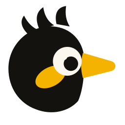

<div align="center">



# mynah

**Say it. It types where you are.**

Press a key, talk, and your words land in whatever window has focus — as you pause, not when you stop.
Everything runs on the machine you are sitting at.

[](LICENSE)
[](#where-it-runs)
[](docs/LINUX-APP.md)

```bash
git clone --recurse-submodules https://github.com/ReidenXerx/mynah.git
cd mynah && make install-app          # macOS: builds and installs Mynah.app
```

**[duduphudu.app/mynah](https://duduphudu.app/mynah/)** — what it does, and what it refuses to do

</div>

---

## Why another dictation tool

Most of them hand the whole recording to a model when you stop talking, then paste the result. Mynah
splits what you say into **utterances** and types each one the moment you pause, so text appears at
the speed of speech instead of arriving in a block.

Getting that right is the hard part, and it is where most of this project lives:

- **A tuned segmentation contract.** `tuning/tuning.toml` holds the thresholds — how long a silence
  ends an utterance, how much trailing silence to trim, how loud speech has to be over the room. They
  are not guesses; they are pinned by a **golden corpus** of recordings in `tuning/golden/`, and the
  test suite fails if a change moves a single boundary.
- **Calibration that cannot backfire.** The noise floor is measured at the start of a session, but its
  contribution is capped: a calibrated gate above the speech line would demand speech louder than
  speech, and no setting could counter it. Frames captured during calibration are kept, not dropped —
  if you start talking immediately, that speech is still segmented.
- **Gates you can move.** Too sensitive in a café, not sensitive enough in a quiet room:
  `mynah set sensitivity=0.005` and try again.

## What a session looks like

```
$ mynah                              # or let the login service run it

  ●  idle          the hotkey is armed, nothing is listening
  ●  listening     you pressed it — the pill shows your level
  ●  transcribing  you paused; this utterance is going into the app
  ●  listening     still your turn
```

The indicator is a small pill, the menu bar or tray item carries start, stop and quit, and the model
stays warm for 45 seconds after you finish so back-to-back dictation is instant. After that it
unloads and Mynah costs nothing at all.

## Install

Mynah is one C++ engine (`libmynah`) with a front end per desktop. There are no
published packages yet — both paths build from source, submodules included.

**macOS** — the menu bar app:

```bash
git clone --recurse-submodules https://github.com/ReidenXerx/mynah.git
cd mynah
make install-app        # builds the core + the app, installs it, launches it
```

It installs to `/Applications/Mynah.app` and signs every build with one local
identity, so the Accessibility grant you give it once survives every rebuild
(see [SWIFT-APP.md](docs/SWIFT-APP.md)). Then: bird → Settings… → Recognition to
download a model, grant Accessibility, and press ⌘⇧. in any text field.

**Linux (Wayland)** — *not finished.* The headless `mynah` binary and its
Arch packaging are written and their tests pass, but nothing has been built or
run on Linux yet, and no AUR package is published. See
[LINUX-APP.md](docs/LINUX-APP.md) for what exists and what is left.

On Omarchy, [omarchy-mynah](https://github.com/ReidenXerx/omarchy-mynah) is the
desktop half: it binds the key, puts the bird in the bar with a live level, and
shows a pill while it listens. Its pinned install still fetches the retired
Python engine; it moves to the binary when Linux ships.

## Commands

On macOS the app is the interface — there is no CLI. On Linux the `mynah` binary
is both the engine and the way anything else drives it, because no Wayland
client may grab a global hotkey:

```bash
mynah                    # run the engine (your compositor binds a key to `mynah toggle`)
mynah toggle             # start or end a session
mynah status             # what it is doing right now
mynah watch              # stream state, level and typed text as JSON lines
mynah setup              # check typing, speech, microphone, hotkey
mynah config             # what it is set to, and where that file is
mynah set hotkey=<f8>    # change one setting
mynah models download small
mynah service install    # start it at login (systemd --user)
```

Settings live in `~/.config/mynah/config.toml`, read and written by both front
ends through the core. Useful ones:

| Setting | What it does |
| --- | --- |
| `hotkey` | The global key (`<cmd>+<shift>+.`, `<f8>`). macOS only — on Wayland your compositor binds `mynah toggle` |
| `trigger` | `toggle` — press to start and stop — or `ptt`, hold to talk |
| `language` | Spoken language code |
| `model` | Speech model name or path; empty means the best one on disk |
| `transcription_mode` | `live` types each utterance as you pause; `on_stop` decodes the whole session at the end |
| `vad` | Split speech into utterances. Off means text only arrives at the end |
| `frame_energy` | Per-frame speech floor: lower hears more, and more of the room |
| `auto_stop_silence` | Seconds of silence that end a session by themselves |

## Where it runs

| | macOS | Linux |
| --- | --- | --- |
| Dictation engine, segmentation, tuning | `libmynah` | the same `libmynah` |
| Speech | whisper.cpp on Metal | whisper.cpp (Vulkan for the `gpu` tier) |
| Typing into the focused window | Accessibility API | `wtype`, and the clipboard for apps that ignore it |
| Hotkey | Carbon `RegisterEventHotKey` | the compositor's own binding, to `mynah toggle` |
| Indicator and menu | native pill + menu bar item | the shell's, through `mynah watch` — a bar widget and a pill on Omarchy |
| Runs at login | `SMAppService` | `systemd --user`, tied to the graphical session |
| Front end | `Mynah.app` — see [SWIFT-APP.md](docs/SWIFT-APP.md) | the `mynah` binary + the desktop's own shell — see [LINUX-APP.md](docs/LINUX-APP.md) |
| State | shipping | written, not yet built or run on Linux |

One engine, written once: segmentation, the tuning contract, voice detection,
speech recognition and the hallucination filter all live in `libmynah` behind a
C API. A front end is capture, input and interface — nothing that decides what
a word is. That is why the tuning contract is shared rather than re-derived, and
why it cannot drift between platforms any more: there is only one copy of it.

Wayland only on Linux, deliberately: on X11 any client can already read the keyboard and inject
keystrokes, so there is nothing to grant and nothing to revoke. GNOME is the gap — it does not
implement the virtual-keyboard protocol `wtype` needs, and a portal injector is not written yet.

## Nothing leaves your machine

Speech is transcribed locally by whisper.cpp, linked into the engine. There is no account, no API
key and no endpoint to disable, because there is none to begin with. The only file Mynah writes
outside its own config is the text it types, into the window you were already in.

## It came out of whiz

Mynah was `whiz dictate` until it outgrew it. [whiz](https://github.com/ReidenXerx/whiz) turns a
recording into a transcript; Mynah types while you talk. Two different jobs that happened to share a
speech engine, so they now share nothing but their maker.

Your old settings are not lost: the first run imports the `dictate_*` keys from
`~/.config/whiz/config.toml` if they are there.

## Tests

```bash
make core-test                  # the engine and the Linux front end (C++)
swift test --package-path macos # the macOS app's own logic
```

`make core-test` runs both C++ suites: the engine's (config, TOML round trips,
the hallucination filter, segmentation against the golden corpus, the session
state machine, three fuzzers) and the Linux front end's (control socket,
injectors, downloads, model tiers). `swift test` covers what is on the app's
side of the C API — the settings wire format and the hotkey parser.

The ones that matter most are the golden-corpus tests: synthesized recordings
with pinned boundaries in `tuning/golden/`, asserted against the segmentation
contract in `tuning/tuning.toml`. `python3 tuning/golden/generate.py`
regenerates them, and refuses to run if its constants have drifted from the
contract — the one piece of Python left, and a developer tool rather than part
of the product.

## License

MIT — see [LICENSE](LICENSE).
